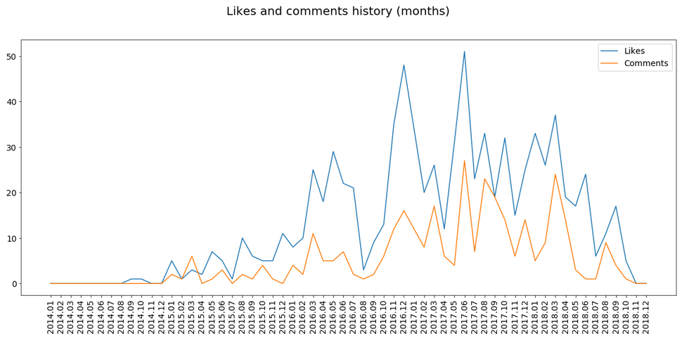

# Visualization of comments and likes history on Facebook

## Description
IPython notebook generating several plots based on a person's Facebook data dump.


 
Personal data dump can be downloaded from Facebook.com (for a logged-in user) as described in the 
[instruction](https://www.facebook.com/help/1701730696756992)


## Requirements
[jupyter](https://pypi.org/project/jupyter/)
```bash
sudo -H pip3 install jupyter
```

[matplotlib](https://pypi.org/project/matplotlib/)
```bash
sudo -H pip3 install matplotlib
```

## Usage
* Download you personal data dump from Facebook according to [instruction](https://www.facebook.com/help/1701730696756992). 
Set JSON as a format for downloading.
* Run jupyter 
```bash
jupyter notebook
```
And open in browser (should start automatically) file facebook.ipynb
* Change path to your facebook dump (in the first cell) and runn the cells
