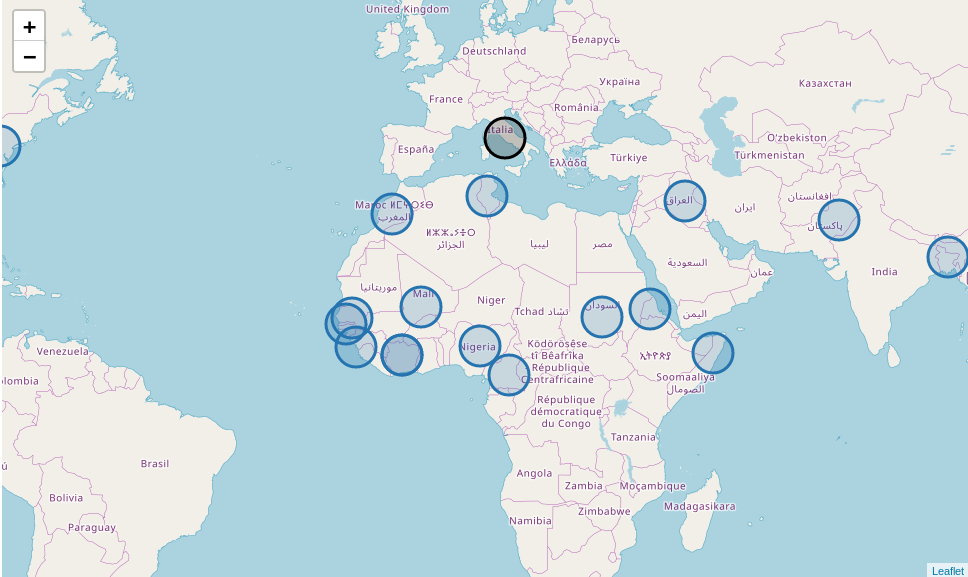
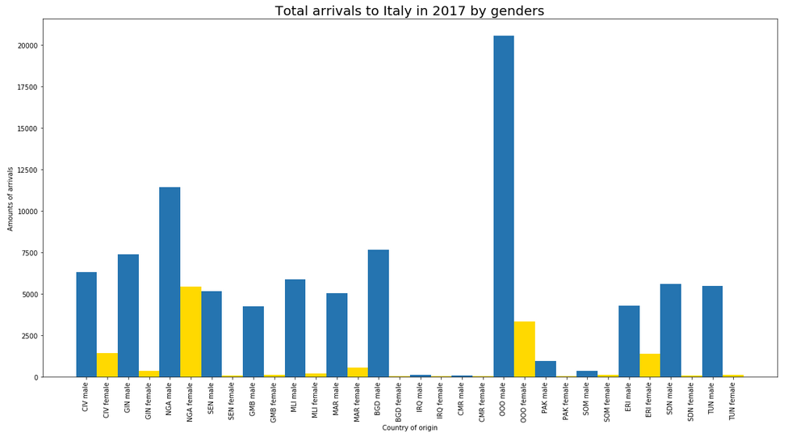

# The IPython notebook visualizing the migration to Italy in 2017

## Description
IPython notebook generating several plots and an interactive map, where one can see, from which countries people were 
arriving to Italy in 2017 and how they were dstributed by gender.



 
The data for processing was taken from: [hudata.org](https://data.humdata.org/dataset/yearly-compilation-of-arrivals-to-europe)

## Requirements
[jupyter](https://pypi.org/project/jupyter/)
```bash
sudo -H pip3 install jupyter
```

[folium](https://pypi.org/project/folium/)
```bash
sudo -H pip3 install folium
```

[matplotlib](https://pypi.org/project/matplotlib/)
```bash
sudo -H pip3 install matplotlib
```

[numpy](https://pypi.org/project/numpy/) (if not installed yet)
```bash
sudo -H pip3 install numpy
```

## Usage
Run jupyter 
```bash
jupyter notebook
```
And open in browser (should start automatically) file Project.ipynb