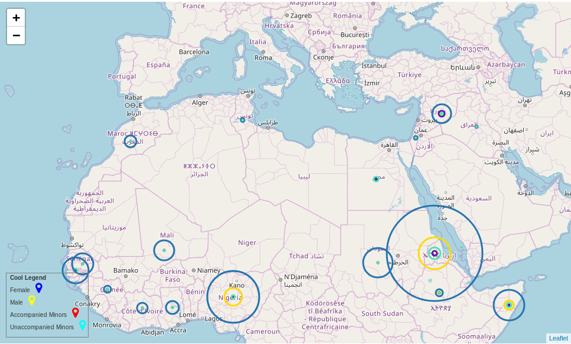

# The map visualizing the migration to Europe in 2017

## Description
IPython notebook generating an interactive map, where one can see, from which countries people were arriving to 
Europe in 2017 and how they were dstributed by gender and age.


 
The data for processing was taken from: [hudata.org](https://data.humdata.org/dataset/yearly-compilation-of-arrivals-to-europe)

## Requirements
[jupyter](https://pypi.org/project/jupyter/)
```bash
sudo -H pip3 install jupyter
```
[folium](https://pypi.org/project/folium/)

```bash
sudo -H pip3 install folium
```
[geopy](https://pypi.org/project/geopy/)
```bash
sudo -H pip3 install geopy
```

## Usage
Run jupyter 
```bash
jupyter notebook
```
And open in browser (should start automatically) file bubbles.ipunb