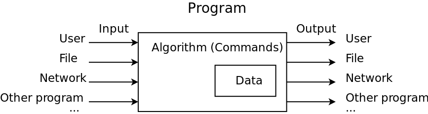

class: title-slide

# Intro to Python: User Input and Variables

## `TODO: link to the Lesson on GitHub here`

---

# Recap: your first program
.left-column[
.normal-code[
```python
# This is my first program
# in Python
# source: code/hello.py

print('hello world!')
```
]
]
.right-column[
- Can't react to user's; actions
- Contains only instructions, doesn’t store data
]
.center[

]

---

# Recap: your second program
.left-column[
.normal-code[
```python
# This is my first program
# in Python
# source: code/two-instructions.py

print('hello world!')
print("My name is Denis")

```
]
]
.right-column[
- Can't react to user's; actions
- Contains only instructions, doesn’t store data
]
.center[

]

