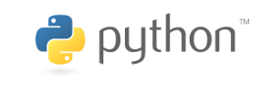

class: title-slide

# Introduction to programming with Python

## ReDI School of Digital Integration

.left-column[
.center[

]]

.right-column[
.left[

]]

---

class: title-slide

# Who are we?

---

class: title-slide

# Who are you?

## (Time to introduce yourself)

---

# What is this course about?

## What will you learn?
* Basic programming concepts
  * Same for many modern programming languages (Python, Java, C++, PHP, Javascript etc.)
  * Words like: loop, variable, function, parameter, library etc.
* Programming skills
  * Problem analysis
  * Problem decomposition
  * Design and implementation
  * Testing and debugging
* Python syntax
  * Essential subset of Python3 features

