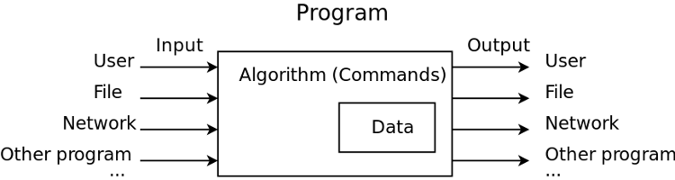
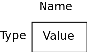

[//]: # (This code is automatically generated by replace-by-file-contents.py script)
[//]: # (located in cmake folder.)
[//]: # (Do not change it manually, but rather change Markdown code)
[//]: # (in appropriate *.md.in file)

class: title-slide

.title-slide-container[
# Interactive programs

## User input, variables, operators, conditionals
]

---

# Recap: your first program

.center[
.bottom-interval[

]
]

.left-column[
```python
# This is my first multi-instruction
# program in Python: It prints two
# lines to the console output

print('Hello world!')
print("My name is Denis")

```
]

.right-column[
* Doesn't interact with a user
* Contains only instructions (algorithm), doesn’t store data
]

---
.big-code[
# Your first interactive program
```python
print('Enter your name')
name = input()
print('Hello, ')
print(name)
```
]

* Run and check the result, please

--

* What’s new:
  * `input()` - another useful built-in function
      * returns value (has result)
      * can have parameters
  * **variable**

---

# Variables

.right[

]

* A "bucket" where you can store some value for later use in your program

--

* Has unique name
  * Can contain letters, numbers or underscores, but can’t start from number
  * Case-sensitive
  * Can’t be the same as Python language keywords

--

* Has type
  * `int`, `float`, `bool`, `string` and some more will come later

--

* Has value
  * Python “guesses“ the type of the variable by the first value assigned to it

--

* Valid variable names: .green[name, last_name, _first_name, name1]
* Invalid variable names: .red[4name, -name, last_$name, 100]

---

# Example: integers

.big-code[
```python
num = 3
print(num, type(num))
Num = -5
print(Num, type(Num))
```
]

* Type `int` for integers

--

* Can be negative or positive

--

* **NB:** Here we have two different variables with different names

--

* Not related to variables themselves:
  * Function `print()` can accept several parameters - will print them one after another
  * Function `type()` returns the type of the variable given as parameter

---

# Example: floating-point numbers

.big-code[
```python
pi = 3.14
print(pi, type(pi))
smallNumber = 3E-10
print(smallNumber, type(smallNumber))

```
]

* Type `float` for floating-point numbers

--

* Different notations:
  * 32.5
  * 0.3
  * .4
  * E-notation: 3E-10 means 3 * 10 ^ (-10)


